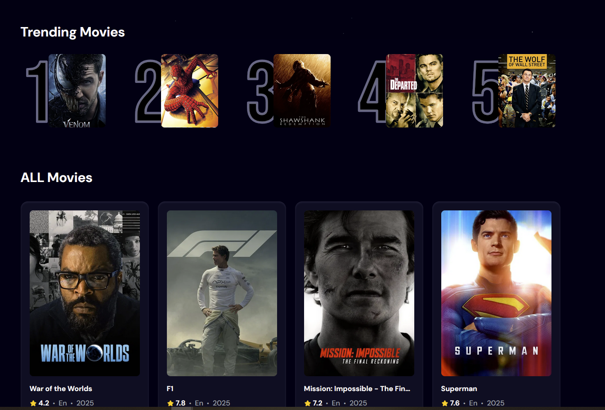

# Movie App 🎬

A web application that lets users explore trending and popular movies, built with React, Supabase, and deployed on Vercel. Movie data is pulled from the [TMDB API](https://www.themoviedb.org/documentation/api).

---

  

  
  
  
  
  
  

---

## Table of Contents

1. [Introduction](#introduction)  
2. [Tech Stack](#tech-stack)  
3. [Features](#features)  

---

## Introduction

A modern web application built with **React** and deployed on **Vercel**, using **Supabase** for authentication and data storage. Users can browse and search movies with live data pulled from **TMDB’s API**. The UI, designed in **Figma**, is clean and user-friendly. Node.js is used as the runtime environment for building and serving the app.

---

## Tech Stack

- **React.js** – Frontend framework  
- **Node.js** – Runtime environment for building & serving  
- **Supabase** – Authentication and database  
- **Vercel** – Deployment platform  
- **Tailwind CSS** – Styling and layout  

---

## Features

- Browse trending movies  
- Search for movies using TMDB API  
- User input updates the database (Supabase)  
- Clean and responsive UI built with Tailwind CSS  
- Deployed and hosted on Vercel  

---
